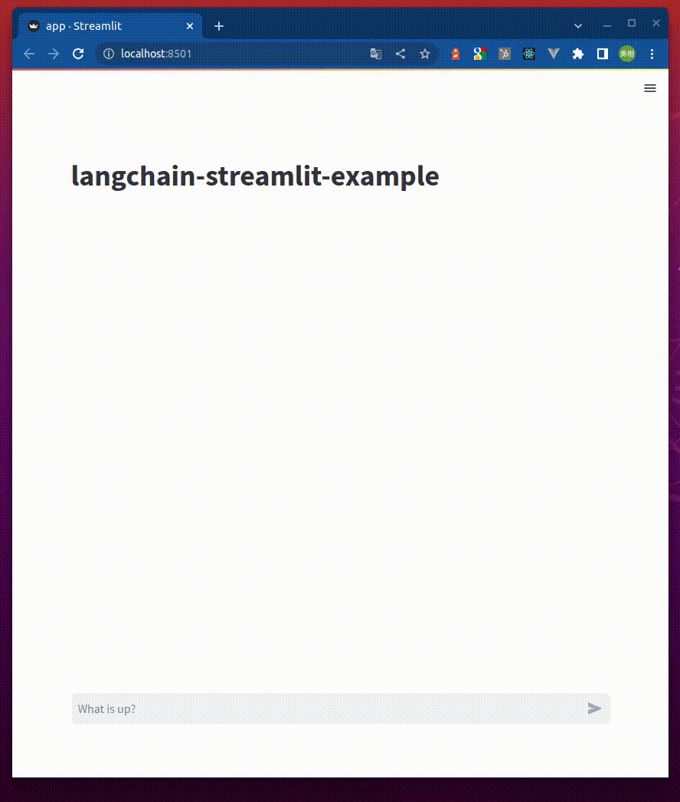

# langchain-streamlit-example

Streamlit で LangChain を使ったチャットボットを実装するサンプルです。



## 機能

チャットボットには以下の機能が実装されています。

- Memory 機能による過去のやりとりを踏まえた応答
- Vector Store (Chroma) を使った独自データへの Q&A
- DuckDuckGo での Web 検索 (API キー不要)
- Wikipedia の検索 (API キー不要)

## 実行手順

.env ファイルを以下の内容で作成

```
OPENAI_API_KEY=<your-openai-api-key>
```

Python のインストール

```console
pyenv local 3.10
```

Python の仮想環境の作成と有効化

```console
python -m venv .venv
. .venv/bin/activate
```

パッケージのインストール

```console
pip install -r requirements.txt
```

文書をベクトル化してローカルに保存

```console
python create_index.py
```

アプリケーションの起動

```console
streamlit run app.py
```

※ `streamlit run app_model_selectable.py` とすると、モデルが選択できるバージョンが起動します

例えば以下のプロンプトで動作確認できます。

- `langchain-streamlit-exampleは何をimportしていますか？`
- `今日のニュースを教えて`
- `WikipediaでChatGPTについて調べて教えて`

## 参考

### Streamlit

- [Build a ChatGPT-like app - Build conversational apps - Streamlit Docs](https://docs.streamlit.io/knowledge-base/tutorials/build-conversational-apps#build-a-chatgpt-like-app)
- [streamlit/llm-examples](https://github.com/streamlit/llm-examples)

### LangChain

- [Streamlit | 🦜️🔗 Langchain](https://python.langchain.com/docs/modules/callbacks/integrations/streamlit)
- [OpenAI functions | 🦜️🔗 Langchain](https://python.langchain.com/docs/modules/agents/agent_types/openai_functions_agent)
- [Add Memory to OpenAI Functions Agent | 🦜️🔗 Langchain](https://python.langchain.com/docs/modules/agents/how_to/add_memory_openai_functions)
- [Chroma | 🦜️🔗 Langchain](https://python.langchain.com/docs/modules/data_connection/vectorstores/integrations/chroma)
- [Vectorstore Agent | 🦜️🔗 Langchain](https://python.langchain.com/docs/modules/agents/toolkits/vectorstore)
- [DuckDuckGo Search | 🦜️🔗 Langchain](https://python.langchain.com/docs/modules/agents/tools/integrations/ddg)
